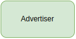

# Auth Operator

This operator serves as the T-CaaS specific authentication (`authN`) and authorization (`authZ`) implementation. The need for this operator arises from the requirement to manage `authN` and `authZ` for multiple cluster consumers in a single cluster. The operator API reference can be found in the `docs/api-reference` directory, specifically for [authorization](https://gitlab.devops.telekom.de/cit/t-caas/operators/auth-operator/-/blob/main/docs/api-reference/authorization.t-caas.telekom.com.md) API group and for [authentication](https://gitlab.devops.telekom.de/cit/t-caas/operators/auth-operator/-/blob/main/docs/api-reference/authentication.t-caas.telekom.com.md) API group. In case the API reference is out of date or you are making changes to the API groups, run `make docs` locally and commit the documentation changes into the repository.

This repository `README.md` contains several logically grouped chapters. The getting started briefly talks about the repository layout and common actions you would like to perform. The architecture chapter briefly shows the high-level architecture of the whole operator. Following the architecture chapter, each component is explained in great detail. Lastly, some informative data is given on cluster participants and the mappings of those participants to their respective roles.

Please use the following table of contents to quickly navigate through the document:
1. [Getting started](#getting-started)
1. [Architecture](#architecture)
1. [Generator](#generator-roledefinition)
1. [Binder](#binder-binddefinition)
1. [IDP client](#idp-client-authprovider)
1. [Authorizer](#authorizer-webhookauthorizer)
1. [Advertiser](#advertiser-registration)
1. [Cluster participants](#cluster-participants)
1. [Group naming convention](#group-naming-convention)
1. [Role mappings](#role-mappings)

## Getting started

To contribute, clone the repository with `SSH` or `HTTPS`. Please make use of the `Makefile` as most common actions that you would like to repeat multiple times are encapsulated in it. The repository structure is the default kubebuilder scaffold for multi-group projects with few additions. Please refer to the snippet below to get acquainted with the `Makefile`:
```bash
$ make help

Usage:
  make <target>

General
  help             Display this help.

Development
  manifests        Generate WebhookConfiguration, ClusterRole and CustomResourceDefinition objects.
  generate         Generate code containing DeepCopy, DeepCopyInto, and DeepCopyObject method implementations.
  fmt              Run go fmt against code.
  vet              Run go vet against code.
  test             Run tests.
  lint             Run golangci-lint linter.
  lint-fix         Run golangci-lint linter and perform fixes.

Build
  build            Build manager binary.
  run-gen          Run Generator controllers and webhooks from your host.
  run-bind         Run Binder controllers and webhooks from your host.
  run-idp          Run IDP controllers and webhooks from your host.
  docker-build     Build docker image with the manager.
  docker-push      Push docker image with the manager.
  docker-buildx    Build and push docker image for the manager for cross-platform support
  build-installer  Generate a consolidated YAML with CRDs and deployment.
  export-images    Export PNG images from a Draw.io diagram.
  docs             Generate markdown API reference into docs directory.

Deployment
  install          Install CRDs into the K8s cluster specified in ~/.kube/config.
  uninstall        Uninstall CRDs from the K8s cluster specified in ~/.kube/config. Call with ignore-not-found=true to ignore resource not found errors during deletion.
  deploy           Deploy controller to the K8s cluster specified in ~/.kube/config.
  undeploy         Undeploy controller from the K8s cluster specified in ~/.kube/config. Call with ignore-not-found=true to ignore resource not found errors during deletion.

Dependencies
  kustomize        Download kustomize locally if necessary.
  controller-gen   Download controller-gen locally if necessary.
  envtest          Download setup-envtest locally if necessary.
  golangci-lint    Download golangci-lint locally if necessary.
  crd-ref-docs     Download crd-ref-docs locally if necessary.
  drawio           Download Draw.io locally if necessary.
```

## Architecture

Architecture diagrams and images can be found in `docs/` directory under `docs/drawio` and `docs/images`. If you want to make any changes to architecture diagrams or images, open the Draw.io diagram file `docs/drawio/auth-operator.drawio` and make your changes on the proper diagram page. When you are satisfied with the changes, save the Draw.io diagram and run the `Makefile` helper target, which will generate images for all diagram pages into the proper directory - `make export-images`. It is enough to commit and push those changes to make them appear in this `README.md` file.

Please refer to the image below for the overall high-level architecture:


___

## Generator (RoleDefinition)

The `generator` component relies on the `RoleDefinition` CRD. Instantiating this custom resource will result in the `generator` component creating a `ClusterRole` or `Role` within the Kubernetes cluster. Please consult the API reference to check the exact types which serve as input to the `generator` component. An example configuration that can be used for testing or reference can be found in `config/samples/authorization_v1alpha1_roledefinition.yaml`. The controller logic flow is fairly simple and follows a predefined set of steps to ensure consistency. The `generator` component is the cornerstone of dynamic Kubernetes RBAC, allowing us to specify a verbose deny list for specific API groups, API resources and verbs on those resources. The controller then discovers all available API groups, API resources and verbs, subtracting the deny list from everything it discovered, and applying the remainder as a `ClusterRole` or `Role` in the respective namespace. Please refer to the image below to visually understand the flow:


Each of the arrows represents a "step" in reconciliation. The detailed explanation is as follows:
  1. Controller checks for deletion timestamp
     - If it is zero, the controller will add the finalizer if it is not already contained.
     - If it is not zero, the controller will check if a finalizer exists.
         1. If finalizer exists, fetch the child resources `ClusterRole` and `Role`, delete the child resources, remove the finalizer from `RoleDefinition` and delete it.
         1. If finalizer does not exist, proceed with deletion of `RoleDefinition`.
  2. Discover API groups using `client-go` discovery package.
  1. Filter API groups against the `RestrictedAPIs` field to reduce the total number of APIs a target `ClusterRole`/`Role` would have access to.
  1. Discover API resources based on the filtered API groups using `client-go` discovery package.
  1. Filter API resources against the `RestrictedResources` field to reduce the total number of API resources a target `ClusterRole`/`Role` would have access to. During this filtering `RestrictedVerbs` field is also checked to strip all verbs which should not be present in the final `ClusterRole`/`Role`.
  1. The remaining API groups and resources with their respective verbs are written into a `PolicyRule` from the `k8s.io/api/rbac/v1` package.
  1. Any duplicates will be removed from the `PolicyRule` and rules will be alphabetically sorted to ensure reading consistency.
  1. The controller will attempt to get an existing child `ClusterRole` or `Role`. If the child is not found, the controller will plumb in the `PolicyRule` specification into the child object and create it.
  1. If the child `ClusterRole`/`Role` is found, the `PolicyRule` from existing in-cluster object is compared to the desired one. If the `PolicyRule` matches no update of rules is performed, if the `PolicyRule` does not match, an update is performed and the in-cluster object is updated/patched.

The `generator` component controller reconciler is triggered on change of `RoleDefinition` CRD, periodically every 60 seconds, and on creation/registration of arbitrary CRD objects.

The reason for periodically triggering the controller reconciler every 60 seconds is to ensure that potential modification of reconcile targets is not tampered with by the cluster consumers. That is, if cluster consumers change the reconcile target manually, the `generator` controller will overwrite the manual changes.

The reason for triggering the controller reconciler on creation/registration of arbitrary `CustomResourceDefinition` objects is to ensure that the cluster consumer registering the new CRD will have re-generated `ClusterRole` or `Role` to gain access to that new CRD.

## Binder (BindDefinition)

The `binder` component relies on the `BindDefinition` CRD. Instantiating this custom resource will result in the `binder` component creating a `ClusterRoleBinding` or `RoleBinding` within the Kubernetes cluster. Please consult the API reference to check the exact types which serve as input to the `binder` component. An example configuration that can be used for testing or reference can be found in `config/samples/authorization_v1alpha1_binddefinition.yaml`. The controller logic flow is fairly simple and follows a predefined set of steps to ensure consistency. The `binder` component is essential for dynamic Kubernetes RBAC, allowing us to specify a namespace selector which will serve as a `key: value` pairs for dynamically binding `ClusterRole` or `Role` resources to `RoleBinding` in the selected namespaces. The creation of `ClusterRoleBinding` resources is not as complex, as the resource is non-namespaced. Please refer to the image below to visually understand the flow:


Each of the arrows represents a "step" in reconciliation. The detailed explanation is as follows:
  1. Controller checks for deletion timestamp on `BindDefinition` resource.
     - If it is zero, the controller will add the finalizer if it is not already contained.
     - If it is not zero, the controller will check if a finalizer exists.
         1. If finalizer exists, fetch the child resources `ServiceAccount`, `ClusterRoleBinding` and `RoleBinding` based on the namespace selector, delete the child resources, remove the finalizer from `BindDefinition` and delete it.
         2. If finalizer does not exist, proceed with deletion of `BindDefinition`.
  2. The controller will attempt to get an existing child `ServiceAccount`, `ClusterRoleBinding` or `RoleBinding`. If the child resources are not found, the controller will attempt to create them.
     - The `ServiceAccount` is created only if namespace for that subject is specified.
     - The `ClusterRoleBinding` and `RoleBinding` will be created according to a naming scheme. The `.spec.targetName` will be the prefix of the created target, the `ClusterRole` or `Role` we are creating the binding for will be the second part of the name, finally we suffix the created target with `-binding`. That is, the full name is constructed as `.spec.targetName + ClusterRole/Role name + '-binding'`.
  3. If the child resources are found, the `Subjects` from existing in-cluster object is compared to the desired one. If the `Subjects` match no update of bindings is performed, if the `Subjects` does not match, an update is performed and the in-cluster object is updated/patched.

The `binder` component controller reconciler is triggered on change of `BindDefinition` CRD, periodically every 60 seconds, and on creation of `Namespace` objects.

The reason for periodically triggering the controller reconciler every 60 seconds is to ensure that potential modification of reconcile targets is not tampered with by the cluster consumers. That is, if cluster consumers change the reconcile target manually, the `binder` controller will overwrite the manual changes.

The reason for triggering the controller reconciler on the creation of `Namespace` objects is to ensure that the cluster consumer creating the `Namespace` will have immediately bound `RoleBinding` to gain access to that new `Namespace`.

## IDP client (AuthProvider)

The `idp` component relies on the `AuthProvider` CRD. Instantiating this custom resource will result in the `idp` component connecting to the selected IDP backend and creating OIDC groups within the IDP system. The `idp-client` is an interface/method group to which custom-built IDP clients have to comply with, if they want to interact with the backend through the Kubernetes API `AuthProvider` CRD abstraction. The reason for creating this component is dynamically creating groups, owners and users in the IDP backend to which the `binder` component will bind `ClusterRole` and `Role` resources generated by the `generator` component. The controller logic flow is fairly simple and follows a predefined set of steps to ensure consistency. The `idp` component is extremely important for dynamic Kubernetes RBAC, allowing us to automate group, owner and user creation, alleviating us from manual interaction with IDP systems and removing potential human errors in the management of OIDC authentication attributes. Please refer to the image below to visually understand the flow:


Each of the arrows represent a "step" in reconciliation. The detailed explanation is as follows:
  1. Delete
  1. Create
  1. Update
  1. Smthn to push


## Authorizer (WebhookAuthorizer)

Feature not implemented yet.


## Advertiser (Registration)

Feature not implemented yet.



___

## Cluster participants

T-CaaS platform recognizes several cluster participants organized in two categories. The first category is `owners` and the second category is `non-owners`. The `owners` category relates to those cluster participants that `own` Kubernetes API resources - `Pods`, `ConfigMaps`, `Secrets`, `Deployments`, `StatefulSets`, `Services`, etc. The `non-owners` category relates to those cluster participants that do not own any Kubernetes API resources. Instead, `non-owners` are organized by the `owners` participants to help with configuration or other actions inside the cluster on the objects owned by the `owners` category. As new `owners` and `non-owners` are recognized, the corresponding role mappings should be updated to reflect the correct situation of ownership or non-ownership of resources within the Kubernetes API.

### Owners

1. **Platform team** is the first `owner` of resources in the Kubernetes API. The platform team is the provider of the T-CaaS platform for its customers. The platform team owns namespaces prefixed with `kube-*` and namespaces which contain the label `t-caas.telekom.com/owner: platform`, as well as the majority of non-namespaced cluster-scoped resources. The ownership is exclusive in order to facilitate the proper functionality of the T-CaaS platform. The platform team has 3 distinctive roles through which members of the team are managed. These 3 roles are applicable to all clusters, in all sites, in all environments. Further role mappings are explained in more detail in the next chapter.
1. **Tenant** is the second `owner` of resources in the Kubernetes API. The tenant is the primary user of the T-CaaS platform through which they deliver NT and IT services. The tenant cannot be the `owner` of namespaces prefixed with `kube-*` and namespaces which contain the label `t-caas.telekom.com/owner: platform`or namespaces which contain the label `t-caas.telekom.com/owner: thirdparty`. Instead, the tenant is given rights to create namespaces and resources within those namespaces. The tenant also has rights to create some non-namespaced resources deemed safe by the platform team. The naming convention of tenant owned resources (both namespaced and non-namespaced) is exclusively determined by the tenant. To control access to namespaced resources for the tenant, on each namespace `create/update/delete` request to the Kubernetes API, the platform team will inject the proper labels into the namespace indicating the ownership and propagating RBAC to downstream resources. The labels that indicate tenant ownership are `t-caas.telekom.com/owner: tenant` and `t-caas.telekom.com/tenant: $tenantName`, where `$tenantName` is the name of that specific tenant. These labels cannot be overwritten by any of the cluster participants and are subject to a `ValidatingWebhook` which will check for validity of the request on namespace `create/update/delete` requests to the Kubernetes API. The tenant has 3 distinctive roles which are tenant-scoped, environment-scoped and cluster-scoped. Further role mappings are explained in more detail in the next chapter.
1. **Third parties** is the third `owner` of resources in the Kubernetes API. Third parties are the secondary users of the T-CaaS platform through which they deliver managed services to the tenant or to the platform team. Third parties cannot be the `owner` of namespaces prefixed with `kube-*` and namespaces which contain the label `t-caas.telekom.com/owner: platform` or namespaces which contain the label `t-caas.telekom.com/owner: tenant`. Instead, third parties are given rights to create namespaces and resources within those namespaces. Third parties also have rights to create some non-namespaced resources deemed safe by the platform team. The naming convention of third party owned resources (both namespaced and non-namespaced) is exclusively determined by the third party. To control access to namespaced resources for third parties, on each namespace `create/update/delete` request to the Kubernetes API, the platform team will inject the proper labels into the namespace indicating the ownership and propagating RBAC to downstream resources. The labels that indicate third party ownership are `t-caas.telekom.com/owner: thirdparty` and `t-caas.telekom.com/tenant: $thirdpartyName`, where `$thirdpartyName` is the name of that specific third party. These labels cannot be overwritten by any of the cluster participants and are subject to a `ValidatingWebhook` which will check for validity of the request on namespace `create/update/delete` requests to the Kubernetes API. Each third party team has 3 distinctive roles through which members of the team are managed. These 3 roles are applicable to all clusters, in all sites, in all environments. Further role mappings are explained in more detail in the next chapter.

Inside the cluster, there can be a single platform team, a single tenant and multiple third parties.

### Non-owners

1. **Onboarding team** is the first `non-owner` of resources in the Kubernetes API. The onboarding team provides network plumbing support to the platform team, tenant and third parties inside the cluster, as well as consulting and support services to the tenant and third parties relating to their service deployments. The onboarding team does not own any namespaces inside the cluster and thus has restricted access to all of them. The onboarding team also has rights to configure specific parts of the T-CaaS platform to satisfy tenant and third party needs. The onboarding team has 3 distinctive roles through which members of the team are managed. These 3 roles are applicable to all clusters, in all sites, in all environments. Further role mappings are explained in more detail in the next chapter.
1. **First line support** is the second `non-owner` of resources in the Kubernetes API. The first-line support team provides incident response services and can do very basic troubleshooting to resolve well-known issues on the platform. This team has the lowest privileges of all teams as they serve as the first responders, usually unable to resolve complex issues requiring elevated privileges. The first-line support team has 3 distinctive roles through which members of the team are managed. These 3 roles are applicable to all clusters, in all sites, in all environments. Further role mappings are explained in more detail in the next chapter.

Inside the cluster, there can be a single onboarding team, and a single first-line support team.

### Participants toggle

It is important to note that not all cluster participants are part of the cluster by default. By default, only `ClusterRoles/Roles` and `ClusterRoleBindings/RoleBindings` for the platform team and for the tenant are created. These two cluster participants are always present in the T-CaaS Kubernetes cluster because the platform team provides the T-CaaS service, while the tenant is the ordering customer which requests a new instance from the T-CaaS platform team. Other cluster participants - third parties, onboarding and first-line support can be included or excluded from a cluster by toggling tenant settings on the `t-caas.telekom.com/v1alpha1` API group.

```yaml
apiVersion: t-caas.telekom.com/v1alpha1
kind: TCaasTenant
metadata:
  name: sample-tenant
  labels:
    t-caas.telekom.com/tenant-name: sample-tenant
spec:
  ...
  supportedBy:
    firstlineSupport: false
    onboardingSupport: true
    thirdPartySupport: true
    thirdPartyComponents:
      - istio
      - monitoring
  ...
```

The example above shows that any clusters which are owned by the tenant `sample-tenant` will have RBAC created for the onboarding team and for third parties - specifically third party teams supporting Istio service mesh and a custom monitoring stack. The example above is also a global tenant-wide setting. Which means it is applicable to *all* clusters owned by this tenant. However, we can provide per-cluster overrides to enable or disable a certain cluster participant via the `TCaasCluster` kind.

```yaml
apiVersion: t-caas.telekom.com/v1alpha1
kind: TCaasCluster
metadata:
  name: sample-cluster
  namespace: c-sample-namespace
spec:
  environment: test
  location: hrzagt5
  tenant:
    ref:
      name: sample-tenant
    overrides:
      supportedBy:
        firstlineSupport: true
        onboardingSupport: false
        thirdPartySupport: true
        thirdPartyComponents:
          - security
  ...
```

The example above shows that we have disabled onboarding teams RBAC in this specific cluster, and we have enabled RBAC for first-line support team. We have also overriden which third-party teams are granted access. This toggle allows for tenants to have globally uniform clusters which have the same cluster participants on all of them, and allows for being more specific - that is, granting access to certain cluster participants only on specific clusters.

___

## Group naming convention

The various IDP backend systems T-CaaS platform uses or will use should adhere to a common naming convention for IDP groups. The naming convention should stay the same across multiple IDPs, except using a prefix for multi-IDP authentication in a single cluster. Currently, there are 3 conventions that are employed in group naming and each of them applies to a different cluster participant.

| Global | Per-environment | Per-cluster |
| ------ | --------------- | ----------- |
| "$participantName"-"$permissionScope"-"$role" | "$participantName"-"$environment"-"$permissionScope"-"$role" | "$clusterName"-"$participantName"-"$siteLocation"-"$environment"-"$permissionScope"-"$role" |

Reading the naming convention in the above format may seem very abstract. However, let's take some example input values and construct groups names. The example values are the following:

```yaml
clusterName: 5gcore
participantName: sddata
siteLocation: hrzagt5
clusterEnv: prod
permissionScope: cluster
role: admin
```

| Global | Per-environment | Per-cluster |
| ------ | --------------- | ----------- |
| sddata-cluster-admin | sddata-prod-cluster-admin | 5gcore-sddata-hrzagt5-prod-cluster-admin |

These three formats will follow *some* cluster participants - namely **tenants**. Each tenant will be given a single global bundle of groups which will cover the whole tenant. This means that assignment to that group is applicable across environments and across clusters. Each tenant will be given a per-environment (test, ref, prod) bundle of groups which will cover the environment-specific accesses. It may be the case that a tenant wants a particular set of people to access production clusters, and another particular set of people to access test clusters. Thirdly, each tenant will be given a per-cluster bundle of groups which will be specific to that cluster only. Allowing the tenant to apply maximum granularity in assigning permissions to its team members.

Some other groups may not have this necessity - namely the platform team, the onboarding team, third-party teams and the first-line support team. These teams will only have `Global` mappings as their teams provide support to multiple cluster consumers across numerous clusters. It would be extremely unpractical and tedious to juggle membership per cluster for a platform team which **must** support all clusters. The same is true for onboarding, third-party teams and first-line support - as they gain access to a cluster by toggling the participant in the `TCaasTenant` specification or by providing overrides in the `TCaasCluster`. If you are unaware of this topic. please refer to the chapter above this one. Otherwise, proceed to role mappings and their respective permissions in the next chapter.

___

## Role mappings

Role mappings are a way to uniquely identify the permission scope and may vary depending on the cluster participant. For some role mappings, you will see a total of 4 roles, but 2 of these roles are assigned through the same group-role mapping. The roles in question are `*-namespaced-reader` and `*-namespaced-reader-restricted`. These roles are assignable through group suffixed with `*-reader` because they are related to cluster participants of type `owners` where the `*-namespaced-reader` is a direct mapping to `owning` namespaces and `*-namespaced-reader-restricted` is a direct mapping to `non-owning` namespaces. These role mappings are subject to change and could be changed if new security circumstances arise.

### Platform team

| Role | Description | Allowed verbs | Restricted API groups | Restricted API resources |
| ---- | ----------- | ------------- | --------------------- | ------------------------ |
| platform-poweruser | Can execute all verbs on resources. | create, delete, deletecollection, patch, update, get, list, watch | | |
| platform-collaborator | Can execute edit verbs on resources. | patch, update, get, list, watch	 | | |
| platform-reader | Can execute read verbs on resources. | get, list, watch | | |
| platform-reader-restricted | Can execute read verbs on resources in non-owned namespaces and a subset of cluster-scoped resources, except on restricted API groups and restricted API resources. This role is attached to tenant namespaces and third party namespaces. | get, list, watch | | secrets, pods/exec, pods/proxy, pods/attach, pods/portforward |


### Tenant

| Role | Description | Allowed verbs | Restricted API groups | Restricted API resources |
| ---- | ----------- | ------------- | --------------------- | ------------------------ |
| tenant-poweruser | Can execute all verbs on resources, except on restricted API groups and restricted API resources. | create, delete, deletecollection, patch, update, get, list, watch | authentication.t-caas.telekom.com/v1alpha1, authorization.t-caas.telekom.com/v1alpha1, cert-manager.io/v1, crd.projectcalico.org/v1, node.k8s.io/v1, trident.netapp.io/v1 | nodes, nodes/proxy |
| tenant-collaborator | Can execute edit verbs on resources, except on restricted API groups and restricted API resources. | patch, update, get, list, watch | authentication.t-caas.telekom.com/v1alpha1, authorization.t-caas.telekom.com/v1alpha1, cert-manager.io/v1, crd.projectcalico.org/v1, node.k8s.io/v1, trident.netapp.io/v1 | nodes, nodes/proxy |
| tenant-reader | Can execute read verbs on resources, except on restricted API groups and restricted API resources. | get, list, watch | | nodes/proxy |
| tenant-reader-restricted | Can execute read verbs on resources in non-owned namespaces and a subset of cluster-scoped resources, except on restricted API groups and restricted API resources. This role is attached to platform namespaces and third party namespaces. | get, list, watch | | secrets, pods/attach, pods/binding, pods/ephemeralcontainers, pods/eviction,  pods/exec, pods/log, pods/portforward, pods/proxy, serviceaccounts/token, services/proxy |

### Third parties

| Role | Description | Allowed verbs | Restricted API groups | Restricted API resources |
| ---- | ----------- | ------------- | --------------------- | ------------------------ |
| third-party-poweruser | Can execute all verbs on resources, except on restricted API groups and restricted API resources. | create, delete, deletecollection, patch, update, get, list, watch | authentication.t-caas.telekom.com/v1alpha1, authorization.t-caas.telekom.com/v1alpha1, cert-manager.io/v1, crd.projectcalico.org/v1, node.k8s.io/v1, trident.netapp.io/v1 | nodes, nodes/proxy |
| third-party-collaborator | Can execute edit verbs on resources, except on restricted API groups and restricted API resources. | patch, update, get, list, watch | authentication.t-caas.telekom.com/v1alpha1, authorization.t-caas.telekom.com/v1alpha1, cert-manager.io/v1, crd.projectcalico.org/v1, node.k8s.io/v1, trident.netapp.io/v1 | nodes, nodes/proxy |
| third-party-reader | Can execute read verbs on resources, except on restricted API groups and restricted API resources. | get, list, watch | | nodes/proxy |
| third-party-reader-restricted | Can execute read verbs on resources in non-owned namespaces and a subset of cluster-scoped resources, except on restricted API groups and restricted API resources. This role is attached to platform namespaces and tenant namespaces. | get, list, watch | | secrets, pods/attach, pods/binding, pods/ephemeralcontainers, pods/eviction,  pods/exec, pods/log, pods/portforward, pods/proxy, serviceaccounts/token, services/proxy |

### Onboarding team

| Role | Description | Allowed verbs | Restricted API groups | Restricted API resources |
| ---- | ----------- | ------------- | --------------------- | ------------------------ |
| onboarding-poweruser | Can execute all verbs on resources, except on restricted API groups and restricted API resources. | create, delete, deletecollection, patch, update, get, list, watch | acme.cert-manager.io/v1, admissionregistration.k8s.io/v1, apiextensions.k8s.io/v1, apiregistration.k8s.io/v1, authentication.t-caas.telekom.com/v1alpha1, authorization.t-caas.telekom.com/v1alpha1, autoscaling/v2, batch/v1, cert-manager.io/v1, certificates.k8s.io/v1, coordination.k8s.io/v1, crd.projectcalico.org/v1, events.k8s.io/v1, flowcontrol.apiserver.k8s.io/v1, node.k8s.io/v1, policy/v1, rbac.authorization.k8s.io/v1, scheduling.k8s.io/v1, snapshot.storage.k8s.io/v1, storage.k8s.io/v1, trident.netapp.io/v1, velero.io/v1 | namespaces, namespaces/finalize, nodes, nodes/proxy, secrets, pods/attach, pods/ephemeralcontainers, pods/exec, pods/portforward, pods/proxy |
| onboarding-collaborator | Can execute edit verbs on resources, except on restricted API groups and restricted API resources. | patch, update, get, list, watch | acme.cert-manager.io/v1, admissionregistration.k8s.io/v1, apiextensions.k8s.io/v1, apiregistration.k8s.io/v1, authentication.t-caas.telekom.com/v1alpha1, authorization.t-caas.telekom.com/v1alpha1, autoscaling/v2, batch/v1, cert-manager.io/v1, certificates.k8s.io/v1, coordination.k8s.io/v1, crd.projectcalico.org/v1, events.k8s.io/v1, flowcontrol.apiserver.k8s.io/v1, node.k8s.io/v1, policy/v1, rbac.authorization.k8s.io/v1, scheduling.k8s.io/v1, snapshot.storage.k8s.io/v1, storage.k8s.io/v1, trident.netapp.io/v1, velero.io/v1 | namespaces, namespaces/finalize, nodes, nodes/proxy, secrets, pods/attach, pods/ephemeralcontainers, pods/exec, pods/portforward, pods/proxy |
| onboarding-reader | Can execute read verbs on resources, except on restricted API groups and restricted API resources. | get, list, watch | | nodes/proxy, secrets, pods/attach, pods/ephemeralcontainers, pods/exec, pods/portforward, pods/proxy |

### First line support

| Role | Description | Allowed verbs | Restricted API groups | Restricted API resources |
| ---- | ----------- | ------------- | --------------------- | ------------------------ |
| first-line-poweruser | Can execute all verbs on resources, except on restricted API groups and restricted API resources. | create, delete, deletecollection, patch, update, get, list, watch | acme.cert-manager.io/v1, admissionregistration.k8s.io/v1, apiextensions.k8s.io/v1, apiregistration.k8s.io/v1, authentication.t-caas.telekom.com/v1alpha1, authorization.t-caas.telekom.com/v1alpha1, autoscaling/v2, batch/v1, cert-manager.io/v1, certificates.k8s.io/v1, coordination.k8s.io/v1, crd.projectcalico.org/v1, events.k8s.io/v1, flowcontrol.apiserver.k8s.io/v1, node.k8s.io/v1, policy/v1, rbac.authorization.k8s.io/v1, scheduling.k8s.io/v1, snapshot.storage.k8s.io/v1, storage.k8s.io/v1, trident.netapp.io/v1, velero.io/v1 | namespaces, namespaces/finalize, nodes, nodes/proxy, secrets, pods/attach, pods/binding, pods/ephemeralcontainers, pods/eviction, pods/exec, pods/log, pods/portforward, pods/proxy, serviceaccounts/token, services/proxy |
| first-line-collaborator | Can execute edit verbs on resources, except on restricted API groups and restricted API resources. | patch, update, get, list, watch | acme.cert-manager.io/v1, admissionregistration.k8s.io/v1, apiextensions.k8s.io/v1, apiregistration.k8s.io/v1, authentication.t-caas.telekom.com/v1alpha1, authorization.t-caas.telekom.com/v1alpha1, autoscaling/v2, batch/v1, cert-manager.io/v1, certificates.k8s.io/v1, coordination.k8s.io/v1, crd.projectcalico.org/v1, events.k8s.io/v1, flowcontrol.apiserver.k8s.io/v1, node.k8s.io/v1, policy/v1, rbac.authorization.k8s.io/v1, scheduling.k8s.io/v1, snapshot.storage.k8s.io/v1, storage.k8s.io/v1, trident.netapp.io/v1, velero.io/v1 | namespaces, namespaces/finalize, nodes, nodes/proxy, secrets, pods/attach, pods/binding, pods/ephemeralcontainers, pods/eviction, pods/exec, pods/log, pods/portforward, pods/proxy, serviceaccounts/token, services/proxy |
| first-line-reader | Can execute read verbs on resources, except on restricted API groups and restricted API resources. | get, list, watch | | nodes/proxy, secrets, pods/attach, pods/binding, pods/ephemeralcontainers, pods/eviction, pods/exec, pods/log, pods/portforward, pods/proxy, serviceaccounts/token, services/proxy |

___
