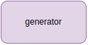
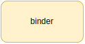
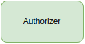
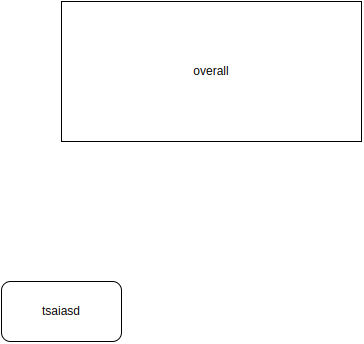

# Auth Operator

[](https://opensource.org/licenses/Apache-2.0)
[](https://github.com/telekom/auth-operator/actions/workflows/reuse-compliance.yml)
[](https://github.com/telekom/auth-operator/actions/workflows/ci.yml)

A Kubernetes operator for managing dynamic RBAC through Custom Resource Definitions. Auth Operator simplifies multi-tenant authorization by providing declarative APIs for generating roles and bindings based on deny-list patterns and dynamic namespace selection.

## Key Features

- 🔐 **Dynamic Role Generation** — Create ClusterRoles/Roles using a deny-list pattern instead of explicit permissions
- 🔗 **Flexible Bindings** — Bind subjects to roles with dynamic namespace selection via label selectors
- 🔄 **Auto-Discovery** — Automatically discovers new CRDs and updates roles accordingly
- 🛡️ **Drift Protection** — Periodically reconciles to prevent unauthorized manual changes
- 📜 **Self-Signed TLS** — No cert-manager required; uses [cert-controller](https://github.com/open-policy-agent/cert-controller) for automatic certificate rotation

---

## Table of Contents

- [Installation](#installation)
- [Quick Start](#quick-start)
- [Configuration](#configuration)
- [CRD Reference](#crd-reference)
- [Architecture](#architecture)
- [Development](#development)
- [Additional Documentation](#additional-documentation)
- [License](#license)

---

## Installation

### Prerequisites

- Kubernetes 1.28+
- Helm 3.17+ (for Helm installation)
- kubectl configured with cluster access

> **Note:** cert-manager is **NOT required**. The operator uses [cert-controller](https://github.com/open-policy-agent/cert-controller) for automatic TLS certificate management.

### Using Helm (Recommended)

```bash
helm install auth-operator oci://ghcr.io/telekom/auth-operator/auth-operator \
  --namespace auth-operator-system \
  --create-namespace \
  --set image.tag=v0.1.0
```

For configuration options, see the [Helm Chart README](./chart/auth-operator/README.md).

### Using Kustomize

```bash
git clone https://github.com/telekom/auth-operator.git
cd auth-operator
make deploy OVERLAY=production
```

### Verify Installation

```bash
kubectl get pods -n auth-operator-system
kubectl get crds | grep t-caas.telekom.com
```

---

## Quick Start

Auth Operator provides three CRDs for managing RBAC:

| CRD | Purpose |
|-----|---------|
| **RoleDefinition** | Generates ClusterRoles/Roles using deny-list pattern |
| **BindDefinition** | Creates ClusterRoleBindings/RoleBindings for subjects |
| **WebhookAuthorizer** | Configures webhook-based authorization *(planned)* |

### 1. Create a RoleDefinition

Generate a ClusterRole that includes all resources *except* those in the deny list:

```yaml
apiVersion: authorization.t-caas.telekom.com/v1alpha1
kind: RoleDefinition
metadata:
  name: tenant-developer
spec:
  targetRole: ClusterRole
  targetName: tenant-developer
  scopeNamespaced: true
  # Deny list - excluded from generated role
  restrictedApis:
    - name: authorization.t-caas.telekom.com
    - name: cert-manager.io
  restrictedResources:
    - name: secrets
    - name: nodes
  restrictedVerbs:
    - deletecollection
```

```bash
kubectl apply -f roledefinition.yaml
kubectl get clusterrole tenant-developer -o yaml
```

### 2. Create a BindDefinition

Bind subjects to roles with dynamic namespace selection:

```yaml
apiVersion: authorization.t-caas.telekom.com/v1alpha1
kind: BindDefinition
metadata:
  name: tenant-developers
spec:
  targetName: tenant
  subjects:
    - apiGroup: rbac.authorization.k8s.io
      kind: Group
      name: developers@example.com
    - kind: ServiceAccount
      name: ci-runner
      namespace: ci-system
  clusterRoleBindings:
    clusterRoleRefs:
      - view
      - tenant-developer
  roleBindings:
    - clusterRoleRefs:
        - edit
      namespaceSelector:
        - matchLabels:
            team: alpha
```

```bash
kubectl apply -f binddefinition.yaml
kubectl get rolebindings -A -l app.kubernetes.io/managed-by=auth-operator
```

---

## Configuration

### Environment Variables

| Variable | Description | Default |
|----------|-------------|---------|
| `NAMESPACE` | Operator namespace | `kube-system` |
| `LEADER_ELECTION` | Enable leader election for HA | `true` |
| `PROBE_ADDR` | Health probe address | `:8081` |
| `METRICS_ADDR` | Prometheus metrics address | `:8080` |
| `WEBHOOK_PORT` | Webhook server port | `9443` |

### Helm Values

| Parameter | Description | Default |
|-----------|-------------|---------|
| `controller.replicas` | Controller replica count | `1` |
| `webhookServer.replicas` | Webhook server replica count | `1` |
| `controller.podDisruptionBudget.enabled` | Enable PDB | `false` |

See [values.yaml](./chart/auth-operator/values.yaml) for all options.

---

## CRD Reference

### RoleDefinition

Dynamically generates ClusterRoles or Roles by discovering all available API resources and subtracting a deny list.

**How it works:**
1. Discovers all API groups and resources in the cluster
2. Filters out resources matching `restrictedApis`, `restrictedResources`, and `restrictedVerbs`
3. Creates/updates the target ClusterRole or Role with the remaining permissions

**Reconciliation triggers:**
- Changes to RoleDefinition resources
- New CRD registrations (to include new resource types)
- Periodic sync every 60 seconds (drift protection)



**Example:** See [config/samples/authorization_v1alpha1_roledefinition.yaml](config/samples/authorization_v1alpha1_roledefinition.yaml)

---

### BindDefinition

Creates ClusterRoleBindings and RoleBindings to bind subjects (Users, Groups, ServiceAccounts) to roles.

**Key capabilities:**
- **Dynamic namespace selection** — Use label selectors to automatically bind to matching namespaces
- **ServiceAccount auto-creation** — Creates ServiceAccounts if they don't exist
- **Mixed bindings** — Combine ClusterRoleBindings and RoleBindings in one resource

**Naming convention:**
Bindings are named as: `{targetName}-{roleName}-binding`

**Reconciliation triggers:**
- Changes to BindDefinition resources
- New Namespace creation (to apply bindings)
- Periodic sync every 60 seconds (drift protection)



**Example:** See [config/samples/authorization_v1alpha1_binddefinition.yaml](config/samples/authorization_v1alpha1_binddefinition.yaml)

---

### WebhookAuthorizer

Configures fine-grained authorization decisions via webhook-based authorization.

*Not yet implemented.*



---

## Architecture



Architecture diagrams are maintained in [docs/drawio/](docs/drawio/). To update:

```bash
# Edit docs/drawio/auth-operator.drawio
make export-images  # Regenerates PNGs
```

---

## Development

### Prerequisites

- Go 1.25+
- Docker
- kubectl
- kind v0.31.0+
- Helm v3.17.0+

### Common Commands

```bash
# Build and test
make build              # Build binary
make test               # Run unit tests
make lint               # Run linter
make manifests generate # Generate code (after editing *_types.go)

# Local development
make deploy OVERLAY=dev # Deploy to current cluster
make run-ctrl           # Run controller locally

# E2E tests
make test-e2e-full      # Full E2E suite
make test-e2e-helm-full # Helm E2E suite
make test-e2e-ha        # HA/leader-election tests
```

### Running E2E Tests

E2E tests use [kind](https://kind.sigs.k8s.io/) for local Kubernetes clusters:

```bash
make test-e2e-full

# Keep cluster for debugging
SKIP_E2E_CLEANUP=true make test-e2e-full

# View test artifacts
ls test/e2e/output/
```

**Troubleshooting:**

```bash
# Export cluster logs
kind export logs ./kind-logs --name auth-operator-e2e

# Check operator logs
kubectl logs -n auth-operator-system -l control-plane=controller-manager
```

For detailed development instructions, see [CONTRIBUTING.md](CONTRIBUTING.md).

---

## Additional Documentation

### Operations
- **[Operator Guide](./docs/operator-guide.md)** — Installation, configuration, HA, upgrades, and day-to-day operations
- **[Debugging Guide](./docs/debugging-guide.md)** — Troubleshooting, diagnostics, and log analysis
- **[Metrics and Alerting](./docs/metrics-and-alerting.md)** — Prometheus metrics and recommended alert rules

### Reference
- **[API Reference](./docs/api-reference/authorization.t-caas.telekom.com.md)** — Full CRD specification
- **[SSA Architecture](./docs/ssa-architecture.md)** — Server-Side Apply patterns, field ownership, and conflict resolution
- **[Condition Lifecycle](./docs/condition-lifecycle.md)** — Condition types, state transitions, and kstatus compliance
- **[Helm Chart](./chart/auth-operator/README.md)** — Helm installation and configuration

### Platform
- **[T-CaaS Integration](./docs/t-caas-integration.md)** — Platform-specific role mappings and group conventions
- **[k8s-breakglass Integration](./docs/breakglass-integration.md)** — Integration with temporary privilege escalation system
- **[Security Policy](.github/SECURITY.md)** — Vulnerability reporting

### Related Projects
- **[k8s-breakglass](https://github.com/telekom/k8s-breakglass)** — Temporary privilege escalation system for Kubernetes

---

## License

Apache 2.0 — See [LICENSE](LICENSE) for details.
