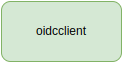

# authn-authz-operator
This operator serves as the T-CaaS specific authentication (`authN`) and authorization (`authZ`) implementation. The need for this operator arises from the requirement to manage `authN` and `authZ` for multiple cluster consumers in a single cluster. The operator API reference can be found in the `docs/reference` directory, specifically for [authorization](https://gitlab.devops.telekom.de/cit/t-caas/operators/authn-authz-operator/-/blob/main/docs/reference/authorization.t-caas.telekom.com.md) API group and for [authentication](https://gitlab.devops.telekom.de/cit/t-caas/operators/authn-authz-operator/-/blob/main/docs/reference/authentication.t-caas.telekom.com.md) API group. In case the API reference is out of date or you are making changes to the API groups, run `make docs` locally and commit the documentation changes into the repository.

## Getting started
To contribute clone the repository with `SSH` or `HTTPS`. Please make use of the `Makefile` as most common actions that you would like to repeat multiple times are encapsulated in it. The repository structure is the default kubebuilder scaffold for multi-group projects with few additions. Please refer to the snippet below for a brief explanation:
```
.
├── api                                                 # Go APIs being reconciled into the cluster, separated by group
│   ├── authentication
│   │   └── v1alpha1
│   └── authorization
│       └── v1alpha1
├── bin                                                 # Static binaries downloaded or built via Makefile
├── cmd
│   └── main.go                                         # The main Go function bootstrapping a Manager
├── config                                              # Different configs that can be used for quick testing of the operator locally
│   ├── certmanager
│   ├── crd
│   ├── default
│   ├── manager
│   ├── prometheus
│   ├── rbac
│   ├── samples                                         # Sample custom resources that can be used for quick testing of the operator locally
│   └── webhook
├── Dockerfile                                          # Main Dockerfile for building the operator container image
├── docs                                                # Docs repository containing API reference, diagrams and images
│   ├── drawio
│   ├── images
│   ├── reference
│   └── config.yaml
├── go.mod
├── go.sum
├── hack
│   └── boilerplate.go.txt
├── helm                                                # Operator Helm packaging that gets pushed to Artifactory/Harbor
│   ├── Chart.yaml
│   ├── crds
│   ├── templates
│   └── values.yaml
├── internal
│   └── controller                                      # Controllers for both API groups with respective reconcile functions
│       ├── authentication
│       └── authorization
├── Makefile                                            # Makefile containing useful repeatable actions
├── pkg
│   ├── client                                          # OIDC client implementations
│   └── conditions                                      # Common conditions getter/setter implementation
├── test
│   ├── e2e
│   └── utils
└── vendor                                              # Vendor dependencies
```


## Architecture
Architecture diagrams and images can be found in `docs/` directory under `docs/drawio` and `docs/images`. If you want to do any changes to architecture diagrams or images, open the Draw.io diagram file `docs/drawio/authn-authz-operator.drawio` and make your changes on the proper diagram page. When you are satisfied with the changes, save the Draw.io diagram and run the `Makefile` helper target which will generate images for all diagram pages into the proper directory - `make export-images`. It is enough to commit and push those changes to make them appear in this `README.md` file.

Please refer to the image below for the overall high level architecture:


## Generator (RoleDefinition)
The `generator` component relies on the `RoleDefinition` CRD. Instantiating this custom resource will result in the `generator` component creating a `ClusterRole` or `Role` within the Kubernetes cluster. Please consult the API reference to check the exact types which serve as input to the `generator` component. An example configuration that can be used for testing or reference can be found in `config/samples/authorization_v1alpha1_roledefinition.yaml`. The controller logic flow is fairly simple and follows a predefined set of steps to ensure consistency. The `generator` component is the cornerstone of dynamic Kubernetes RBAC, allowing us to specify a verbose denylist for specific API groups, API resources and verbs on those resources. The controller then discovers all available API groups, API resources and verbs subtracting the denylist from everything it discovered, and applying the remainder as a `ClusterRole` or `Role` in the respective namespace. Please refer to the image below to visually understand the flow:


Each of the arrows represents a "step" in reconciliation. The detailed explanation is as follows:
  1. Controller checks for deletion timestamp
     - If it is zero, the controller will add the finalizer if it is not already contained.
     - If it is not zero, the controller will check if a finalizer exists. 
         1. If finalizer exists, fetch the child resources `ClusterRole` and `Role`, delete the child resources, remove the finalizer from `RoleDefinition` and delete it.
         2. If finalizer does not exist, proceed with deletion of `RoleDefinition`.
  2. Discover API groups using `client-go` discovery package.
  3. Filter API groups against the `RestrictedAPIs` field to reduce the total number of APIs a target `ClusterRole`/`Role` would have access to.
  4. Discover API resources based on the filtered API groups using `client-go` discovery package.
  5. Filter API resources against the `RestrictedResources` field to reduce the total number of API resources a target `ClusterRole`/`Role` would have access to. During this filtering `RestrictedVerbs` field is also checked to strip all verbs which should not be present in the final `ClusterRole`/`Role`.
  6. The remaining API groups and resources with their respective verbs are written into a `PolicyRule` from the `k8s.io/api/rbac/v1` package.
  7. Any duplicates will be removed from the `PolicyRule` and rules will be alphabetically sorted to ensure reading consistency.
  8. The controller will attempt to get an existing child `ClusterRole` or `Role`. If the child is not found, the controller will plumb in the `PolicyRule` specification into the child object and create it.
  9. If the child `ClusterRole`/`Role` is found, the `PolicyRule` from existing in-cluster object is compared to the desired one. If the `PolicyRule` matches no update of rules is performed, if the `PolicyRule` does not match, an update is performed and the in-cluster object is updated/patched.

The `generator` component controller reconciler is triggered on change of `RoleDefinition` CRD, periodically every 60 seconds, and on creation/registration of arbitrary CRD objects. 

The reason for periodically triggering the controller reconciler every 60 seconds is to ensure that potential modification of reconcile targets is not tampered with by the cluster consumers. That is, if cluster consumers change the reconcile target manually, the `generator` controller will overwrite the manual changes. 

The reason for triggering the controller reconciler on creation/registration of arbitrary `CustomResourceDefinition` objects is to ensure that the cluster consumer registering the new CRD will have re-generated `ClusterRole` or `Role` to gain access to that new CRD.


## Binder (BindDefinition)
The `binder` component relies on the `BindDefinition` CRD. Instantiating this custom resource will result in the `binder` component creating a `ClusterRoleBinding` or `RoleBinding` within the Kubernetes cluster. Please consult the API reference to check the exact types which serve as input to the `binder` component. An example configuration that can be used for testing or reference can be found in `config/samples/authorization_v1alpha1_binddefinition.yaml`. The controller logic flow is fairly simple and follows a predefined set of steps to ensure consistency. The `binder` component is essential for dynamic Kubernetes RBAC, allowing us to specify a namespace selectors which will serve as a `key: value` pairs for dynamically binding `ClusterRole` or `Role` resources to `RoleBinding` in the selected namespaces. The creation of `ClusterRoleBinding` resources is not as complex, as the resource is non-namespaced. Please refer to the image below to visually understand the flow:


Each of the arrows represents a "step" in reconciliation. The detailed explanation is as follows:
  1. Controller checks for deletion timestamp on `BindDefinition` resource.
     - If it is zero, the controller will add the finalizer if it is not already contained.
     - If it is not zero, the controller will check if a finalizer exists. 
         1. If finalizer exists, fetch the child resources `ServiceAccount`, `ClusterRoleBinding` and `RoleBinding` based on the namespace selector, delete the child resources, remove the finalizer from `BindDefinition` and delete it.
         2. If finalizer does not exist, proceed with deletion of `BindDefinition`.
  2. The controller will attempt to get an existing child `ServiceAccount`, `ClusterRoleBinding` or `RoleBinding`. If the child resources are not found, the controller will attempt to create them.
     - The `ServiceAccount` is created only if namespace for that subject is specified.
     - The `ClusterRoleBinding` and `RoleBinding` will be created according to a naming scheme. The `.spec.targetName` will be the prefix of the created target, the `ClusterRole` or `Role` we are creating the binding for will be the second part of the name, finally we suffix the created target with `-binding`. That is, the full name is constructed as `.spec.targetName + ClusterRole/Role name + '-binding'`.
  3. If the child resources are found, the `Subjects` from existing in-cluster object is compared to the desired one. If the `Subjects` match no update of bindings is performed, if the `Subjects` does not match, an update is performed and the in-cluster object is updated/patched.

The `binder` component controller reconciler is triggered on change of `BindDefinition` CRD, periodically every 60 seconds, and on creation of `Namespace` objects. 

The reason for periodically triggering the controller reconciler every 60 seconds is to ensure that potential modification of reconcile targets is not tampered with by the cluster consumers. That is, if cluster consumers change the reconcile target manually, the `binder` controller will overwrite the manual changes. 

The reason for triggering the controller reconciler on creation of `Namespace` objects is to ensure that the cluster consumer creating the `Namespace` will have immediately bound `RoleBinding` to gain access to that new `Namespace`.

## OIDC client (AuthProvider)
The `oidc-client` component relies on the `AuthProvider` CRD. Instantiating this custom resource will result in the `oidc-client` component connecting to the selected IDP backend and creating OIDC groups within the IDP system. The `oidc-client` is an interface/method group to which custom built IDP clients have to comply with, if they want to interact with the backend through the Kubernetes API `AuthProvider` CRD abstraction. The reason for creating this component is dynamically creating groups, owners and users in the IDP backend to which the `binder` component will bind `ClusterRole` and `Role` resources generated by the `generator` component. The controller logic flow is fairly simple and follows a predefined set of steps to ensure consistency. The `oidc-client` component is extremely important for dynamic Kubernetes RBAC, allowing us to automate group, owner and user creation aleviating us from manual interaction with IDP systems and removing potential human errors in management of OIDC authentication attributes. Please refer to the image below to visually understand the flow:



Each of the arrows represent a "step" in reconciliation. The detailed explanation is as follows:
  1. Delete
  2. Create
  3. Update

***
